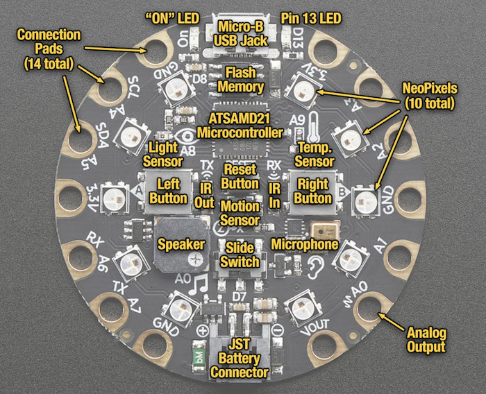

### Agenda
* 09:30 Welcome
* 10:00 Intro
* 11:00 Start hacking
* 12:00 Lunch (sponsored by Container Solutions)
* 13:00 More hacking
* 17:30 Demo & Drinks
* 19:00 Doors closed

---

### Adafruit Circuit Playground Express

---

### Setup Express Board

* [Driver for Windows users](https://learn.adafruit.com/adafruit-circuit-playground-express/adafruit2-windows-driver-installation)
* Connect to USB
* Press reset button to go to bootloader

---

# Microsoft Makecode

---

* [Adafruit Makecode](https://makecode.adafruit.com/)
* [Get started](https://learn.adafruit.com/adafruit-circuit-playground-express/downloading-and-flashing)
* [Documentation](https://makecode.adafruit.com/docs)

---

# CircuitPython

---

* [Get started](https://learn.adafruit.com/adafruit-circuit-playground-express/circuitpython-quickstart)
* [Install Mu editor](https://learn.adafruit.com/adafruit-circuit-playground-express/installing-mu-editor)
* [Documentation](http://circuitpython.readthedocs.io/projects/circuitplayground/en/latest/api.html)

---

# Arduino IDE

---

* [Get started](https://learn.adafruit.com/adafruit-circuit-playground-express/set-up-arduino-ide)
* Dependencies: `apt get install openjdk-11-jdk-headless bossa-cli
* [Arduino IDE](https://www.arduino.cc/en/main/software)
* [Board manager config](https://adafruit.github.io/arduino-board-index/package_adafruit_index.json)

---

## Useful Links

* [Pinout](https://cdn-learn.adafruit.com/assets/assets/000/047/156/original/circuit_playground_Adafruit_Circuit_Playground_Express_Pinout.png?1507829017)

---

## Ideas

* Polyhedron (dice)
* Light sensor
* Countdown
* Timer 
* Temperature sensor
